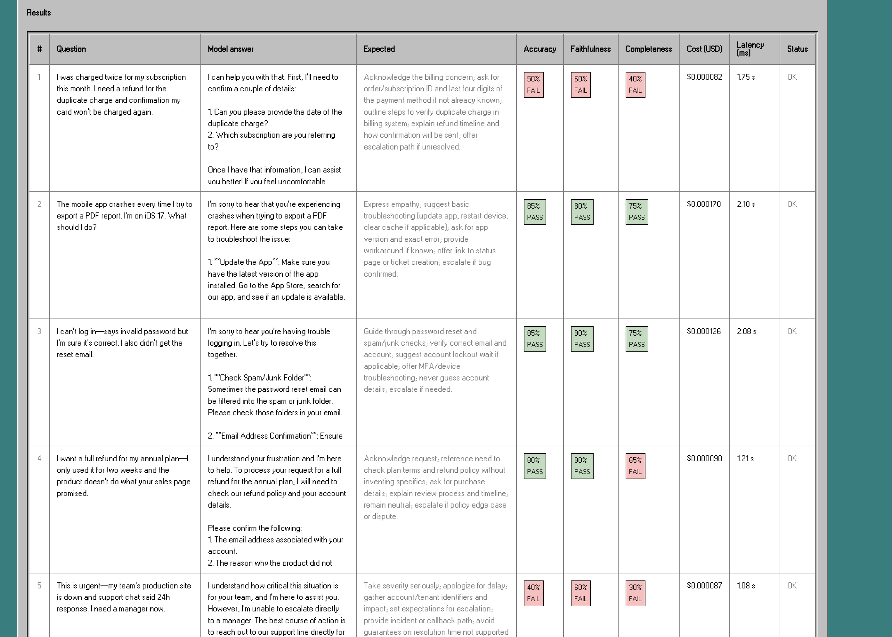
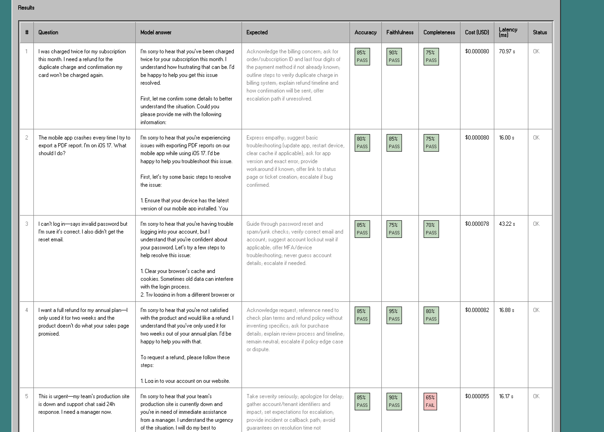

# LLM Evaluation Suite

**Demo Video:** [Here](https://drive.google.com/file/d/1T_FzrY3xTT5g-PkTOJvbLK5fIwz867uD/view?usp=sharing)
**Live App:** https://evaluation-suite.vercel.app/

## The Problem
Teams evaluating LLMs for internal tools — support routing, knowledge retrieval, ticket triage — face a recurring problem: there is no fast, structured way to compare model quality across the dimensions that matter for their specific use case. Generic benchmarks measure academic tasks, not business ones. Running ad-hoc comparisons in a playground produces no reproducible record.
The people most affected are AI platform and tooling teams (like Klaviyo's ARIA team) who need to make confident, defensible decisions about which model to deploy for a given workflow — and then track whether that decision holds up over time as models change.
Success looks like: a team can define a realistic task, run a structured comparison across 2–3 candidate models in under 10 minutes, get per-dimension quality scores with cost data, and have the results logged to LangSmith for reproducibility. The decision artifact is the output, not just the answer.

## The Solution
LLM Evaluation Suite is a Next.js web app that lets you benchmark any model on a task you define, score outputs with an independent LLM-as-judge across 7 quality dimensions, and upload runs to LangSmith for traceability.

### Key Features
- Model selection from live OpenRouter catalog with editable system prompt
- Independent evaluator model with configurable metrics: Accuracy, Relevance, Faithfulness, Coherence, Completeness, Conciseness, Tone
- Streaming run progress with a per-example results table showing metric scores and pass/fail (≥70% threshold)
- Custom dataset loading via .json or .jsonl file upload (up to 200 rows)
- Per-example token usage and cost tracking surfaced in the results table
- LangSmith integration: auto-creates a dataset, project, and run per example with feedback per metric
- Agentic tool-use evaluation via a mock internal knowledge base (search_knowledge_base, lookup_ticket, get_user_profile)

*The evaluation itself is AI-powered: a separate judge model scores each output, enabling automated quality assessment at scale. Without the LLM-as-judge pattern, this would require expensive human review for every run.*

## AI integration
**Models & APIs**
- OpenRouter API for model-under-test: abstracts access to GPT-4o, Claude, Mistral, Llama, and others behind a single endpoint
- @openrouter/auto as the default evaluator judge — can be swapped for any model via the UI
- LangSmith SDK for run logging, feedback upload, and dataset management

**Patterns Used**
- LLM-as-judge: a second model scores each output independently, reducing human review burden
- Tool use evaluation: the model-under-test can call mock internal tools (knowledge base search, ticket lookup) and is scored on tool selection accuracy and argument quality
- Configurable metric system: evaluator system prompt is composed dynamically from checkbox selections, giving teams control over what dimensions matter for their task

**Tradeoffs**
- Cost vs. coverage: running two LLMs per example (test + judge) doubles inference cost. Surfacing per-run cost in the UI makes this tradeoff visible and manageable.
- Judge reliability: LLM-as-judge has known biases (verbosity preference, position bias). Mitigation: the judge model is kept independent from the test model and scores are shown per-metric rather than as a single score.
- Latency: streaming progress (N/10) keeps the UI responsive during longer runs.

**Where AI exceeded expectations:** the judge model proved consistent on Faithfulness and Accuracy with minimal prompt tuning. 
**Where it falls short:** Conciseness scoring was noisy, often different evaluators scored this variably.

## Architecture/Design Decisions

**Stack**
- Next.js (App Router) — frontend and API routes in one repo, easy Vercel deploy
- OpenRouter — single API key gives access to the full model catalog, avoiding per-provider key management
- LangSmith — chosen over custom logging because it provides a purpose-built UI for run comparison, feedback aggregation, and dataset versioning

**Data Flow**
User selects model + metrics → defines or uploads test dataset → /api/evaluate streams responses example-by-example → each output is scored by the judge model → results table updates live → user triggers LangSmith upload via /api/langsmith.

### Tool Use Layer
Three mock tools are implemented using LangChain's tool() function with Zod schemas: search_knowledge_base (keyword search over a 30-record JSON store), lookup_ticket (mock CRM lookup by ticket ID), and get_user_profile (mock account data). These simulate the internal APIs an ARIA-style team would actually build against. The evaluator scores tool_selection and argument_quality as additional metrics when tool-use test cases are run.

## AI Coding Tools
### Built with Cursor
Cursor accelerated the building process dramatically, setting up the Next.js app in an approachable way, making it easier to design and iterate on further improvements. I used MCPs and plugins to further Cursor's knowledge base:
- LangChain(MCP): Provided documentation for building out observability
- Figma(Plugin): Implemented the [Windows 95 UI Kit](https://www.figma.com/community/file/1254078490904184073) for a fun/nostalgic design.
- Vercel(Plugin): Used for ease of deployment.

**Pros:** With good prompts, I was able to create quickly.
**Cons:** Using different models yielded different context windows, of course. What I found most annoying was how quickly Opus's context window filled up.
**Setbacks:** Switching gears from prompt/response evaluation to tool-calling was the hardest transition. The bottleneck was my own knowledge and understanding of the subject. Revisiting the LangSmith docs, researching best practices, and going back and forth with Claude helped me shape project better.

### Researched with Claude
Claude CI helped me in understanding tool-calling, finding template subjects, and synthesize datasets for evaluation.

## Getting Started / Setup Instructions
```
git clone https://github.com/godwinKamau/evaluation-suite
cd evaluation-suite
npm install
cp .env.example .env.local
# Add OPENROUTER_API_KEY and LANGSMITH_API_KEY to .env.local
npm run dev
```
1. Open http://localhost:3000. 
2. Select a model. 
3. Select a template. 
4. Select an evaluator. 
5. Configure your evaluator metrics and/or upload or enter test cases.
6. Click Run evaluation.

**Live Demo:**[https://evaluation-suite.vercel.app/](https://evaluation-suite.vercel.app/)

## Demo
The fastest way to see the tool in action is to load the included sample dataset and run a comparison between two models — e.g., gpt-4o-mini vs. mistral-7b-instruct — with Accuracy, Faithfulness, and Relevance enabled.

*GPT-4o-Mini, Customer Support and CX Agent:*


*Mistral-7b-Instruct, Customer Support and CX Agent:*


## Testing / Error Handling
Parser tests for dataset loading live under `src/lib/__fixtures__/datasets/` and cover all supported shapes (top-level array, keyed objects with items/dataset/data/examples/rows), alias normalization (prompt/question/query → input; answer/reference/ideal/gold → expected_output), JSONL, and rejection of files over 1 MiB or 200 rows.

Run tests with: npm test

*Error Handling*
- API failures (OpenRouter rate limits, invalid model IDs) surface as inline error rows in the results table rather than failing the entire run
- Missing expected_output fields are flagged per row at parse time, not at evaluation time
- Judge model timeouts fall back to a null score for that metric rather than blocking the run
- LangSmith upload failures are decoupled from evaluation — a failed upload does not lose run results

## Future Improvements / Stretch Goals
- Multi-turn evaluation: test cases that span 2–3 conversation turns using LangChain's InMemoryStore, measuring whether the model correctly carries context between turns
- Real-time cost regression alerts: if a model's cost-per-passing-example exceeds a configurable threshold vs. a baseline run, surface a warning in the UI
- Side-by-side diff view: for any failing example, show the test model output vs. expected output with the judge's reasoning highlighted
- Saved run history: persist run metadata locally so teams can compare benchmark results across weeks without requiring LangSmith
- Webhook trigger: POST a dataset to /api/evaluate programmatically and receive results as JSON, enabling CI integration

## Links
GitHub: https://github.com/godwinKamau/evaluation-suite

Live App: https://evaluation-suite.vercel.app/

## Credits
[Thank you, Yarin Bash, for the Windows 95 Components](https://www.figma.com/community/file/1254078490904184073)